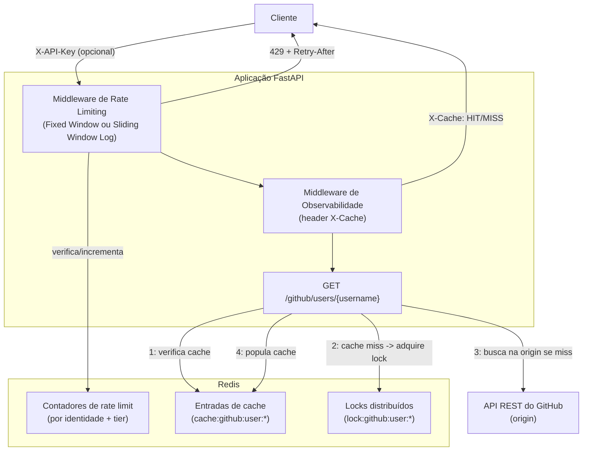

# High-Performance Patterns FastAPI

Um serviço estilo **API Gateway** construído com **FastAPI** e **Redis**, demonstrando padrões de infraestrutura de nível produção: algoritmos de rate limiting configuráveis, acesso em camadas (tiers) via API key, cache-aside com proteção anti-stampede, e observabilidade a nível de requisição.

Este projeto foca intencionalmente em **profundidade de infraestrutura e corretude algorítmica**, em vez de lógica de CRUD/negócio — é um projeto complementar ao [AsyncTask Hub](https://github.com/PedroHTLemos/async-task-hub) (processamento assíncrono de tarefas com Celery/Postgres), cobrindo o lado de API Gateway do design de sistemas distribuídos.

## Arquitetura



**Fluxo da requisição para `GET /github/users/{username}`:**

1. O middleware de rate limiting verifica a identidade de quem chamou (tier da API key, ou IP para anônimos) contra contadores armazenados no Redis. Exceder o limite retorna `429` com headers `Retry-After` e `X-RateLimit-*`.
2. A rota verifica o Redis em busca de uma resposta em cache (padrão cache-aside).
3. Em caso de **hit** no cache, o payload cacheado é retornado imediatamente.
4. Em caso de **miss** no cache, a requisição tenta adquirir um lock distribuído (`SET NX EX`) antes de chamar a API do GitHub. Quem detém o lock busca na origin e popula o cache; requisições concorrentes para a mesma chave fazem polling no cache em vez de avançarem todas para a origin (stampede).
5. O middleware de observabilidade adiciona um header `X-Cache: HIT` / `MISS` consistente em toda resposta, independente de qual caminho de código a gerou.

## Padrões implementados

| Padrão | Onde | Notas |
|---|---|---|
| **Rate limiting Fixed Window** | `app/middlewares/rate_limiter.py` | Redis `INCR`/`EXPIRE`, chaveamento por identidade |
| **Rate limiting Sliding Window Log** | `app/middlewares/sliding_window_rate_limiter.py` | Redis `ZSET` (`ZREMRANGEBYSCORE`/`ZCARD`/`ZADD`), evita o problema de burst na borda da janela do Fixed Window |
| **Controle de acesso em camadas (tiers)** | `app/core/api_keys.py` | Header `X-API-Key` mapeia para tiers anônimo / free / premium, cada um com seu próprio limite |
| **Cache-aside** | `app/routes/github.py` | Cache em Redis na frente da API REST do GitHub, com TTL configurável |
| **Lock distribuído anti-stampede** | `app/routes/github.py` | Lock via `SET NX EX` + polling dos "perdedores", evita thundering-herd na expiração do cache |
| **Invalidação de cache** | `DELETE /github/users/{username}/cache` | Endpoint explícito de purga |
| **Observabilidade de requisição** | `app/middlewares/observability.py` | Middleware ASGI puro (não `BaseHTTPMiddleware`, para evitar armadilhas conhecidas de gerenciamento de estado sob carga concorrente); header `X-Cache` consistente em toda resposta |

O algoritmo de rate limiting é selecionado em tempo de execução via a variável de ambiente `RATE_LIMIT_ALGORITHM` (`fixed_window` ou `sliding_window_log`), permitindo comparar as duas implementações lado a lado sem alterar código.

## Stack

| Camada | Tecnologia |
|---|---|
| Framework de API | FastAPI |
| Cache / armazenamento de rate limit / locks | Redis 7 |
| Linguagem | Python 3.12 |
| Containerização | Docker, Docker Compose |
| Teste de carga | k6 |

## Executando localmente

```bash
docker compose up --build
```

A API estará disponível em `http://localhost:8000`.

### Exemplos de requisições

```bash
# Requisição anônima (tier de rate limit baixo)
curl -i http://localhost:8000/github/users/octocat

# Requisição autenticada (tier de rate limit maior)
curl -i -H "X-API-Key: <sua-key>" http://localhost:8000/github/users/octocat

# Purgar uma entrada do cache
curl -i -X DELETE http://localhost:8000/github/users/octocat/cache
```

Toda resposta inclui:
- `X-Cache: HIT | MISS | N/A` — se a resposta veio do cache, da origin, ou não se aplica à rota
- `X-RateLimit-Limit`, `X-RateLimit-Remaining`, `X-RateLimit-Tier` — estado atual do rate limit para quem chamou
- Em `429`: `Retry-After` — segundos até a janela de quem chamou resetar

## Benchmarks

Testado sob carga com [k6](https://k6.io) (script em [`load-tests/load-test.js`](load-tests/load-test.js)). Cada cenário isola um caminho de código específico para evitar contaminação entre as medições:

| Cenário | Latência p95 | O que mede |
|---|---|---|
| Cache **MISS** (origin) | ~270 ms | Round-trip real até a API do GitHub |
| Cache **HIT** (steady-state) | ~14 ms | Leitura direta do Redis, sem contenção |
| Cache **HIT** (pós-stampede, lock-wait) | ~323 ms | Requisições que perderam a disputa pelo lock distribuído e esperaram quem ganhou popular o cache |
| Rate limiting sob carga | — | `429` + `Retry-After` retornados corretamente em centenas de requisições concorrentes; zero falhas não tratadas |

**Speedup do cache: ~19x** (270 ms → 14 ms) em steady-state.

A linha de "lock-wait" é talvez o número mais interessante aqui: ela mostra que, mesmo no *pior caso* — todas as requisições concorrentes colidindo numa chave de cache recém-expirada — nenhuma requisição fica mais lenta do que um cache miss comum já seria. O lock distribuído troca uma pequena latência extra para uma única requisição (quem detém o lock) pela proteção da origin contra um thundering herd, em vez de deixar todas as N requisições concorrentes baterem na API do GitHub simultaneamente.

## Decisões de design

- **Por que um lock distribuído em vez de deixar os cache misses "stampedarem"?** Com cache em Redis, uma chave expirada sob carga concorrente faria com que toda requisição em andamento batesse na API de origin simultaneamente — multiplicando a carga sobre uma API de terceiros que tem seus próprios limites. O lock (`SET NX EX`) garante que apenas uma requisição repopula o cache; as demais esperam brevemente e então leem a entrada já atualizada.
- **Por que dois algoritmos de rate limiting?** Fixed Window é simples e barato, mas permite até 2x o limite em bursts nas bordas da janela. Sliding Window Log é mais preciso (sem burst de borda), ao custo de armazenar um timestamp por requisição em um `ZSET` do Redis. Implementar os dois lado a lado, selecionáveis via variável de ambiente, demonstra o trade-off na prática em vez de só descrevê-lo.
- **Por que um middleware ASGI puro para observabilidade, em vez de `BaseHTTPMiddleware`?** Durante o teste de carga, uma implementação inicial baseada em `BaseHTTPMiddleware` pareceu, a princípio, estar vazando estado entre requisições concorrentes. Trocar para um middleware ASGI puro (que encapsula o `scope`/`send` de cada requisição individualmente, em vez de compartilhar estado mutável através de um par `dispatch`/`call_next`) é a escolha mais defensiva sob concorrência, e foi adotada como precaução mesmo depois que a anomalia original do teste de carga se revelou ter uma causa raiz diferente (ver abaixo).
- **Investigando um "bug" que não era bug:** durante o benchmark, `cache_hit_latency_ms` mostrou uma distribuição bimodal — majoritariamente poucos milissegundos, mas uma cauda consistente de ~10% em ~300+ ms. A suspeita inicial foi um bug no middleware. A causa real: o cenário de benchmark purga o cache e imediatamente dispara 20 usuários virtuais concorrentes contra a mesma chave, deliberadamente disparando exatamente o stampede que o lock distribuído foi feito para tratar. As requisições "lentas" eram os perdedores do lock, corretamente classificadas como `HIT` no cache (já que, no fim, seus dados vieram do cache), mas com a latência dominada pela espera no polling. Separar a métrica em `cache_hit_latency_ms` e `cache_hit_after_lock_wait_latency_ms` confirmou isso e transformou uma sessão de debugging em uma das linhas mais úteis do benchmark.

## Estrutura do projeto

```
app/
├── core/
│   ├── api_keys.py        # mapeamento API key -> tier, limites por tier
│   ├── config.py          # configuração via variáveis de ambiente
│   ├── github_client.py   # cliente da API do GitHub (origin)
│   └── redis_client.py    # conexão com Redis
├── middlewares/
│   ├── rate_limiter.py               # algoritmo Fixed Window
│   ├── sliding_window_rate_limiter.py # algoritmo Sliding Window Log
│   └── observability.py              # middleware do header X-Cache
├── routes/
│   └── github.py          # cache-aside + lock distribuído + purga de cache
└── main.py

load-tests/
└── load-test.js           # script de benchmark com k6
```
